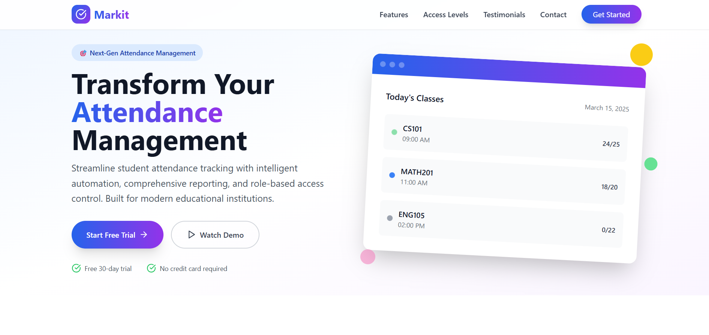

📘 Markit - Student Attendance Management System (SAMS)
Tech Stack: Node.js, Express.js, MongoDB, Mongoose, TypeScript, JWT Authentication

🧩 Project Overview
The Student Attendance Management System (SAMS) is a full-stack web application designed to streamline the process of tracking, managing, and reporting student attendance in educational institutions. The system provides role-based access for administrators and lecturers to manage academic activities such as course creation, student and lecturer management, class scheduling, attendance marking, and report generation.
Built with a scalable backend architecture using Node.js and Express.js, and powered by MongoDB for flexible and efficient document storage, SAMS enables real-time data handling and centralized control over institutional attendance workflows.

🎯 Core Features
1)User Authentication & Role Management
  * Secure login system using JWT with distinct roles: Admin and Lecturer.
  * Access control to ensure users interact only with permitted modules.

2)Course & Subject Management
  * Full CRUD operations to manage courses and their associated subjects.

3)Student Information System
  * Create and maintain detailed student profiles including course enrollment, registration number, and contact details.

4)Lecturer Management
  * Maintain lecturer profiles and assign them to specific subjects and class schedules.

5)Class Scheduling
  * Schedule classes by selecting course, subject, lecturer, date, and time.
  * Ensures a structured timetable for students and lecturers.

6)Attendance Marking
  * Lecturers can mark student attendance for each scheduled class session.
  * Attendance status is stored securely for reporting and analytics.

7)Dynamic Attendance Reporting
 * Generate attendance reports by student, subject, or date range.
 * Supports data filtering and export-ready formats (e.g., CSV or PDF).

🏗️ Technical Highlights

  Node.js + Express.js for a high-performance REST API.

MongoDB + Mongoose ODM for flexible schema modeling.

TypeScript for type safety and scalable codebase.

JWT-based Authentication to secure endpoints and manage user sessions.

Modular and layered code structure following industry best practices (MVC).

Designed with future front-end integrations in mind (e.g., React, Angular).

📈 Impact & Use Case
This system is ideal for universities, schools, and training institutes aiming to automate attendance processes, reduce manual errors, and provide transparency through data-driven reports. It replaces traditional paper-based systems with a reliable, centralized digital solution.

